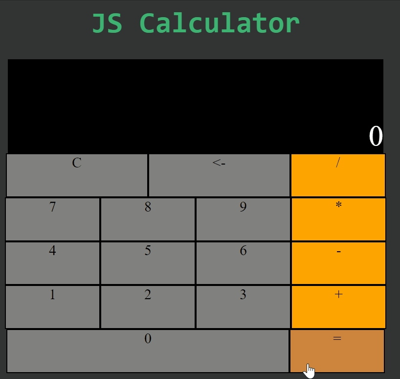

# Calculator
A simple integer calculator in JavaScript

[Live site](http://ryanjim.me/Calculator/)  

  

## Instructions

Click the numbers followed by an operations button  
To see the result click the equals button 

## Built With

* [Vanilla JS](https://developer.mozilla.org/en-US/docs/Web/JavaScript) - No frameworks used  

## Acknowledgments

* This project idea is from freeCodeCamp    
 
